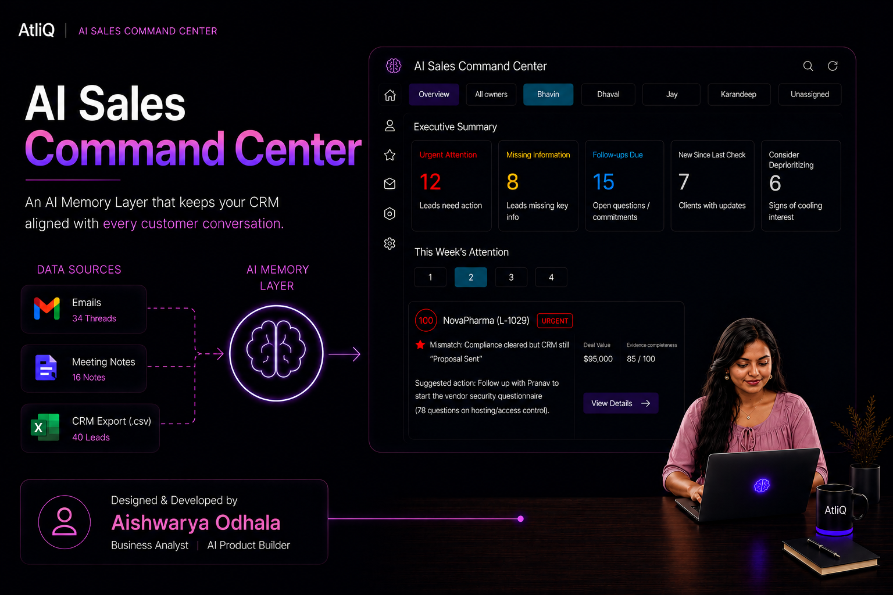
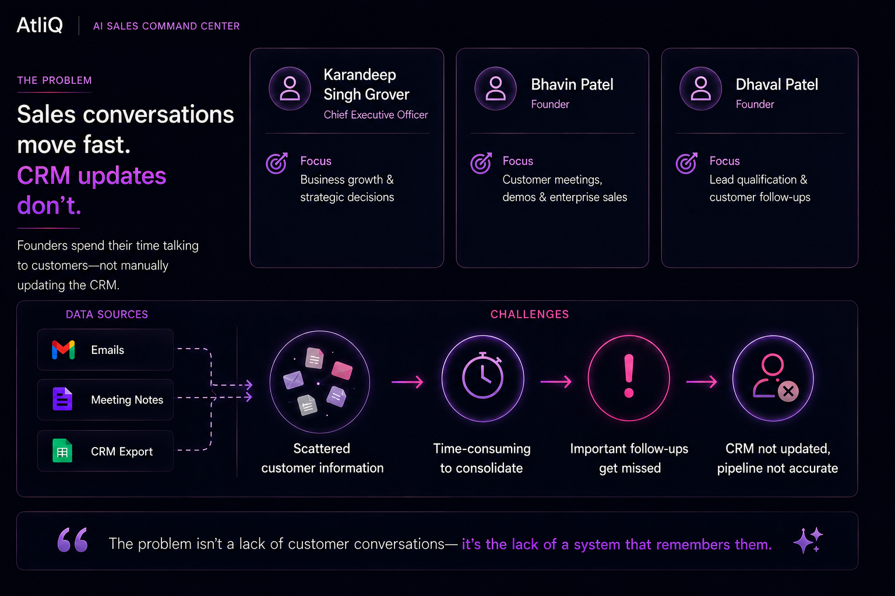

# AtliQ AI Sales Command Center

A read-only AI memory layer that keeps AtliQ's CRM aligned with what's actually happening in every email thread and meeting note — surfacing mismatches, missing info, and time-sensitive follow-ups in plain language, with evidence.

🔗 **Live Demo:** [AI Sales Command Center](https://ai-sales-command-center-5srun5kqnywjo2wb4dfy3u.streamlit.app/)

## The Problem

Sales conversations move fast, but CRM updates don't — founders and reps spend their time talking to customers, not manually logging every follow-up, so important details get scattered across emails and meeting notes instead of the CRM.

## The Solution

The AI Sales Command Center loads the CRM export alongside every linked email and meeting note, cross-references them, and flags what's inconsistent, missing, or overdue — each finding backed by a verbatim quote from its source document. It never edits the CRM, emails, or notes, and never sends anything; every suggestion is a label for a human to review, not an automatic action.

## Tech Stack / How It Works

Built with **Streamlit** (UI) and the **Anthropic API** (Claude, for grounded per-lead analysis), with a rule-based linker/duplicate-detector layer (no LLM) handling CRM-to-document matching. Every AI-returned quote is checked against the real source text before it's ever displayed — ungrounded findings are dropped, not shown as fact.

See [APP_README.md](APP_README.md) for full setup, run instructions, and architecture details.

## Project Documentation

1. **Completed user research worksheet** 
   [AtliQ_Problem_Discovery_User_Research.xlsx](Project%20Docs/AtliQ_Problem_Discovery_User_Research.xlsx) (+ [PDF companion](Project%20Docs/AtliQ_Problem_Discovery_User_Research.pdf)) 
   Persona, empathy map, 5 Whys, root-cause problem statement, and proposed solution.

2. **AI opportunity map** 
   [AI Product Canvas.pdf](Project%20Docs/AI%20Product%20Canvas.pdf) 
   The founder's sales workflow broken into stages, AI capability mapping, and ethical risk mitigation cards (Miro board export).

3. **AI PRD** 
   [AI_PRD.pdf](Project%20Docs/AI_PRD.pdf) 
   Product requirements for the chosen solution, including a dedicated North Star and Metrics section.

4. **Cost estimation** 
   [Cost_Estimation.xlsx](Project%20Docs/Cost_Estimation.xlsx) (+ [PDF companion](Project%20Docs/Cost_Estimation.pdf)) 
   Model(s) used, expected token usage per interaction, expected volumes, and infrastructure costs.

5. **Working AI prototype** 
   See [APP_README.md](APP_README.md) for setup/run instructions, or the live demo linked above. 
   This repo: working code plus this README explaining how to run it.

6. **Presentation** 
   [AtliQ_Product_Story_Presentation.pptx](Project%20Docs/AtliQ_Product_Story_Presentation.pptx) 
   The problem and discovery insights, the opportunity chosen, the solution and a walkthrough, success metrics, and risks and guardrails.

7. **Stakeholder demo video** 
   *(TBD — not yet recorded.)* 
   A ~5-minute walkthrough of the live prototype handling real dataset scenarios, presented to AtliQ's stakeholders.

Assignment brief, for reference: 
[Capstone 1 Brief - AtliQ Sales and CRM Assistant.pdf](Project%20Docs/Capstone%201%20Brief%20-%20AtliQ%20Sales%20and%20CRM%20Assistant.pdf)

Additional docs (not part of the official checklist, kept for reference): 
[Feature_Guide.pdf](Project%20Docs/Feature_Guide.pdf) · [AtliQ_Product_Presentation.pdf](Project%20Docs/AtliQ_Product_Presentation.pdf) (PDF export of item 6's presentation, for viewing without PowerPoint)

## Dataset

Full field-by-field documentation of `crm_export.csv`, `emails/`, and `meeting_notes/` lives in [DATA_DICTIONARY.md](DATA_DICTIONARY.md).
